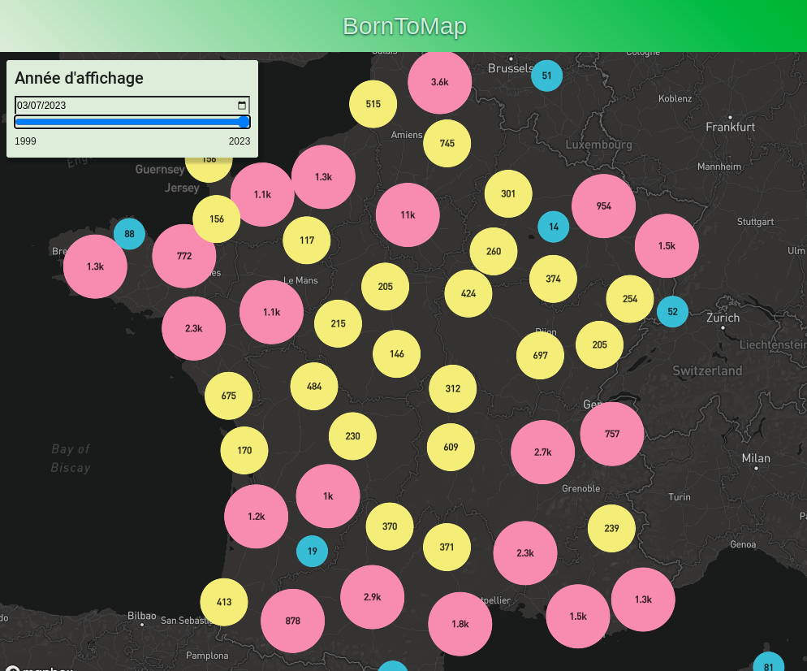

# BornToMap



# Description

A web interface showing the evolution of electric vehicules charging network.

# Members
- DELAPART Thomas
- GOARDOU Fabien
- LE LAN Quentin
- MORVAN Arthur
- PICAUD Tom
- SAUVAT Bastien
- TSAGAAN Tergel

---

# Launch

## Requirements
- Docker

## Run
Access frontend with http://localhost/

Copy the [docker compose file](./compose.yml) or download the project, and run :
```shell
docker compose up -d
```

# Compile

## Development
```shell
sh dev.sh # Linux
./dev.bat # Windows
```
In development mode, you have access to adminer : http://localhost/adminer  
With System `Postgres`

## Production
```shell
sh prod.sh # Linux
./prod.bat # Window
```
